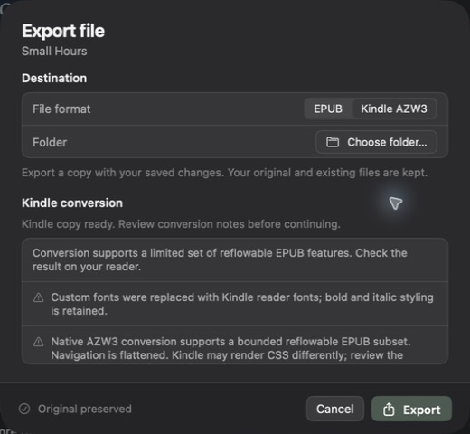
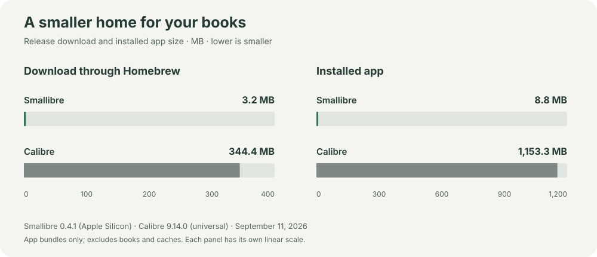

<div align="center">

# Smallibre

A small, native macOS ebook manager for a simpler reading routine.

macOS 14+ · Apple Silicon · Free & open source

[Install](#-install) · [Reader compatibility](#reader-compatibility) · [Contribute](CONTRIBUTING.md)

</div>

A native Calibre alternative: 8.8 MB versus 1 GB, with ebook essentials built in Swift. **Smallibre focuses on the everyday essentials:** a tidy library, useful book details, EPUB personalization, and reliable reader transfers.


<table>
  <tr>
    <td width="33%" align="center" valign="top"><a href="docs/screenshots/preview.jpg"></a><br><b>Preview chapters</b></td>
    <td width="33%" align="center" valign="top"><a href="docs/screenshots/typography.jpg"></a><br><b>Make reading yours</b></td>
    <td width="33%" align="center" valign="top"><a href="docs/screenshots/conversion.jpg"></a><br><b>Prepare a Kindle copy</b></td>
  </tr>
</table>

*Actual app screenshots using a disposable library of authored mock books. Click a detail image to enlarge it.*

## Why Smallibre?

- **🪶 About 99% smaller.** Just 8.8 MB installed versus Calibre’s 1.15 GB in the comparison below, with no additional runtime.
- **🍎 Native performance, modern Mac UI.** Built in Swift with system frameworks, native controls, keyboard shortcuts, and light and dark appearances.

## Small app, small footprint



| App | Download through Homebrew | Installed app |
| --- | ---: | ---: |
| **Smallibre 0.4.1** | **3.2 MB** | **8.8 MB** |
| Calibre 9.14.0 | 344.4 MB | 1,153.3 MB |

## 🚀 Install

Requires **Apple Silicon and macOS 14 or later**.

```sh
brew install --cask tajchert/tap/smallibre
```

Or download from [GitHub Releases](https://github.com/tajchert/smallibre/releases).

**First launch:** the app is ad-hoc signed and not notarized. If macOS blocks it, review the app and choose **System Settings → Privacy & Security → Open Anyway** ([Apple’s guidance](https://support.apple.com/en-us/102445)).

### Your first book

1. Open Smallibre and choose **Explore with a sample book**, or drop in your own ebooks.
2. Select a book to preview it or open **Details & Typography…**.
3. Connect a mounted Kindle and choose **Send to Kindle**, or press **⌘E** to export a file.

To update an existing Homebrew installation:

```sh
brew update
brew upgrade --cask smallibre
```

## Reader compatibility

**Your reader must appear as a mounted drive or folder on your Mac.** Smallibre detects mounted Kindles automatically, with a folder picker as a fallback. The mounted workflow has been tested on a Kindle Paperwhite (11th generation); other models still need coverage.

| Book or connection | What works today |
| --- | --- |
| Reflowable EPUB | Import, preview, edit metadata and typography, export EPUB |
| Supported EPUB → Kindle AZW3 | Native conversion, conversion notes, local export, mounted-Kindle sending |
| DRM-free MOBI / standalone AZW3 | Import and export original bytes; metadata updates on supported device copies |
| Mounted USB reader | Browse, transfer, download, back up, and delete selected copies |
| MTP reader | No app connection or transfers yet |
| DRM-protected books / KFX | Limited device listing; no decryption, import, or editing |

**Conversion is focused on ordinary reflowable books.** Complex layouts, SVG/MathML, scripts, and media overlays are unsupported. Custom fonts fall back to reader fonts. Review the [conversion limitations](docs/epub-kindle-limitations.md) and check the result on your reader.

There is no automatic mirroring. If a transfer is interrupted, check **Backups & history** and refresh the reader before retrying; cancellation does not prove that nothing was written.

## Smallibre or Calibre?

**Choose Smallibre for a focused native Mac workflow.** [Calibre](https://manual.calibre-ebook.com/) offers a broader toolkit, especially for advanced library management and conversion.

| Feature | Smallibre today | Calibre |
| --- | --- | --- |
| Conversion | Supported EPUB → AZW3 | Many formats, advanced controls, bulk conversion |
| Organization | Covers, search, sorting, format filters | Also tags, series, ratings, custom fields, saved searches |
| Bulk editing | Individual book edits | Metadata and cover updates across many books |
| Book formats | Separate imports | Multiple formats grouped under one book |
| Reading & search | EPUB preview; title/author search | Full reader, highlights, bookmarks, full-text search |
| Content editing | Metadata and EPUB typography | EPUB/AZW3 HTML and CSS editor |
| Reader connections | Mounted drives/folders | Broader device support, MTP and wireless/email options |
| Extras | Local library | Web library server, news downloads, plugins, CLI tools |
| Platforms | macOS | macOS, Windows, Linux |

## Where the project is going

The goal is a **focused native Mac companion for your ebooks**, with quick local import, restrained personalization, and dependable transfers.

Next priorities:

- Broader EPUB conversion compatibility and more testing on real readers.
- Reliable MTP connections and transfers.
- More library-management tools and measured large-library performance.
- Developer ID signed, notarized downloads and release automation.

## Build & contribute

Bug reports, reader compatibility reports, and focused fixes are welcome. Start with [Contributing](CONTRIBUTING.md).

To build locally, use macOS 14+ and an Xcode toolchain with Swift 6:

```sh
swift test
bash scripts/build-app.sh
open build/Smallibre.app
```

The build targets your Mac’s architecture and signs the app locally. You can also open `Package.swift` in Xcode.

<details>
<summary><b>Handy keyboard shortcuts</b></summary>

| Shortcut | Action |
| --- | --- |
| ⌘O | Add books |
| ⌘K / ⌘F | Search all books / the current collection |
| ⌘R | Preview the selected EPUB |
| ⌘I | Edit the selected book’s details |
| ⌘E | Export a file |
| ⇧⌘F | Reveal the original in Finder |
| ⇧⌘R | Refresh the reader |
| ⌘1–⌘6 | Switch library collections and reader view |

Book commands require a selected book. The app’s native menus list all shortcuts.

</details>

For deeper technical context, see [development guidance](AGENTS.md), the [EPUB-to-Kindle workflow](docs/architecture/epub-kindle-workflow.md), [reader reliability](docs/architecture/reader-reliability.md), and [MTP status](docs/handoffs/mtp-readers.md).

Licensed under **[GPL-3.0-only](LICENSE)**. No Calibre code is bundled. The included “Small Hours” sample and test fixtures were authored for this project.
