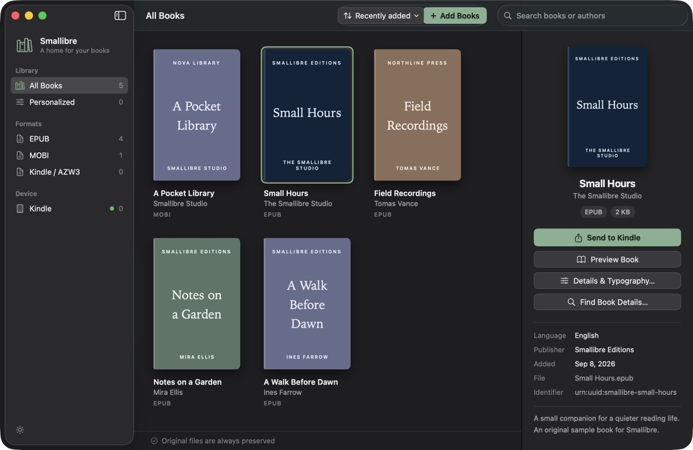
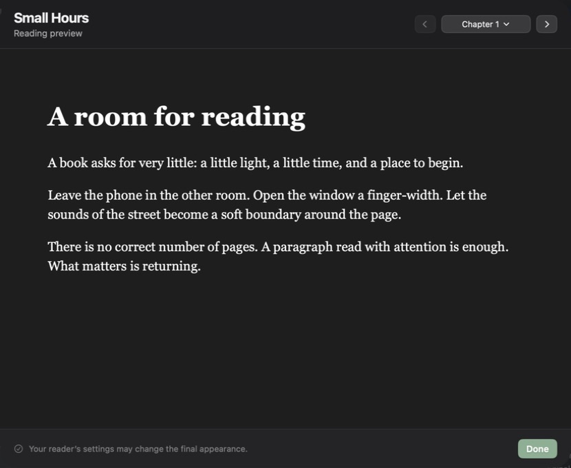
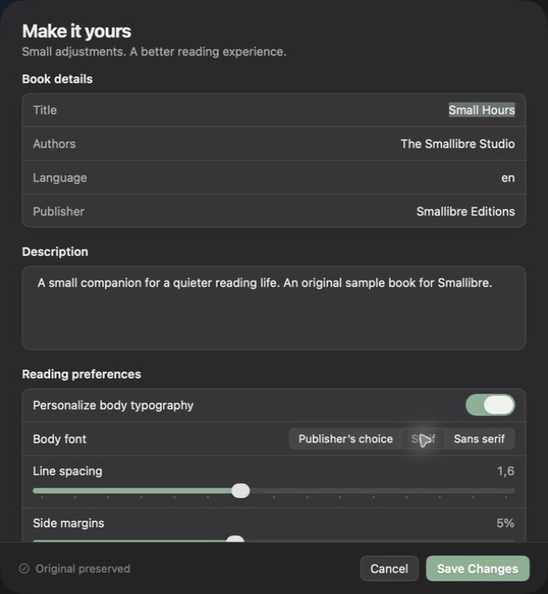

<div align="center">

# Smallibre

**Your books. Your Mac. Your reader.**

A small, native macOS app for organizing ebooks and taking them with you.

macOS 14+ · Swift · GPL-3.0 · Early alpha

</div>

Smallibre brings your ebook library and your connected reader into one place. Add books, tidy their details, adjust EPUB typography, and manage the books on a mounted Kindle—all through a native Mac interface.

Inspired by Calibre, Smallibre takes a deliberately smaller scope with a custom Swift book engine. The current Apple Silicon app is approximately **6.7 MB**. No Calibre installation or additional runtime is needed.

> **Early alpha:** mounted-reader management is available today. Version 0.3.4 includes one-click mounted-Kindle sending, native EPUB-to-AZW3 conversion, font fallback, and local Kindle export. MTP is at the read-only diagnostic stage. Builds are locally ad-hoc signed, not Developer ID signed or notarized.

## What you can do

- **Build your bookshelf.** Import EPUB, MOBI, and standalone AZW3 books. Browse covers, search, and sort your library. Identical files are detected automatically.
- **Make books yours.** Edit book details, review suggestions from Open Library, and adjust fonts, spacing, and margins in reflowable EPUBs.
- **Send EPUBs to Kindle.** Click **Send to device** to detect a mounted Kindle, convert the EPUB, and send a verified copy. After sending, the device list and copy badge update automatically; books sent during the session appear first, and matching books show a disabled **Already on device** button. Folder selection is only needed if automatic detection fails; the fallback also supports EPUB readers. Use the export icon beside **Send to device** to choose a file format and destination folder. EPUB books can be exported as EPUB or Kindle AZW3; MOBI/AZW3 books retain their original format. Supported EPUBs keep saved metadata and typography changes.
- **Take a look inside.** Preview EPUB chapters before exporting a new copy.
- **See what’s on your Kindle.** Browse a mounted reader and see exact matches with your Mac library.
- **Manage device copies.** Download supported books, back up files, or delete selected copies after a verified local backup. Update title, author, and publisher on supported DRM-free MOBI/AZW3 device files.

## Screenshots

Browse your library and inspect book details.



Preview EPUB chapters before exporting.



Adjust book details, body typography, line spacing, and margins.



*Captured from the macOS app using a disposable library of authored demo books.*

## Install

Requires **Apple Silicon and macOS 14 or later**:

```sh
brew install --cask tajchert/tap/smallibre
```

Or download the app from [GitHub Releases](https://github.com/tajchert/smallibre/releases). This early-alpha build is not notarized. If macOS blocks the first launch, use **System Settings → Privacy & Security → Open Anyway** after reviewing the app ([Apple’s guidance](https://support.apple.com/en-us/102445)).

## Build from source

You need macOS 14 or later and an Xcode toolchain with Swift 6.

From the project folder:

```sh
swift test
bash scripts/build-app.sh
open build/Smallibre.app
```

Choose **Explore with a sample book**, or drop your own EPUB or MOBI into the window. Select a book to see its details, personalize an EPUB, or prepare an export.

The build script creates an app for your Mac’s architecture and signs it locally. It does not create a universal or notarized release. You can also open `Package.swift` in Xcode to work on the project.

## Keyboard shortcuts

Shortcuts are listed in the app’s native menus and apply to the active library window.

| Shortcut | Action |
| --- | --- |
| ⌘K | Search all library books, leaving the current filter or reader view |
| ⌘F | Search the current collection or reader |
| ⌘1–⌘6 | All Books, Personalized, EPUB, MOBI, Kindle / AZW3, Kindle Reader |
| ⌘O | Add books |
| ⌘R | Preview the selected EPUB |
| ⌘I | Edit the selected book’s details |
| ⌘E | Export file (format and location) |
| ⇧⌘F | Show the selected original in Finder |
| ⇧⌘R | Refresh the connected reader when idle |

Search matches titles and authors. Book commands require a selection visible in the current library collection.

## Will it work with my reader?

Smallibre currently works with readers that appear as a mounted drive or folder on your Mac. Kindle Paperwhite testing has covered inventory, transfer, download, backup, deletion of a disposable copy, and metadata updates. Reading the test copy was confirmed on the device; other models and books still need testing.

| Book or connection | Current support |
| --- | --- |
| Reflowable EPUB | Import, preview, edit details and typography, export EPUB |
| DRM-free MOBI / standalone AZW3 | Import and export; supported device copies allow metadata updates |
| EPUB → Kindle format | Native AZW3 preparation, automatic mounted-Kindle send, conversion notes and local export |
| Mounted USB reader | Inventory and explicit transfer/management actions |
| MTP reader | Developer read-only probe; no app connection or transfer support |
| DRM-protected books / KFX | Limited device listing; no decryption, import, or editing |

Library metadata edits are embedded in EPUB exports. MOBI/AZW3 exports from the library preserve original bytes; editing device metadata is a separate action. Smallibre does not automatically mirror or delete books when you connect a reader. Reader helpers run only for individual operations, without periodic polling. Unrelated volume mounts do not trigger scans. System sleep cancels reader work and invalidates device selections; after waking, refresh explicitly and check Backups & history before retrying an interrupted write. Cancellation does not prove a write failed, and interrupted writes are never automatically replayed.

Fixed-layout EPUBs, scripted books, media overlays, embedded-font customization, and broad format conversion are outside the current scope. Large-library performance has not yet been established.

## Conversion and MTP development status

Native conversion now prepares immutable AZW3 artifacts with source, settings, converter-version and output hashes. A send uses the exact prepared artifact, creates a new device file, verifies a full readback and retains a backup and receipt. Corrupt cached files are rejected; interrupted writes are never retried automatically.

The supported profile is deliberately bounded: reflowable EPUB 2/3, ordinary prose and lists, internal links, PNG/JPEG images, cover metadata, and basic inline/linked CSS. Nested navigation is flattened with a conversion note. DRM, SVG/MathML, scripts, media overlays, remote resources and CSS imports are rejected. Version 0.3.0 adds font fallback for embedded and recognized obfuscated fonts, plus simple page-margin normalization. See the [known limitations and missing features](docs/epub-kindle-limitations.md) before relying on conversion for complex books.

Earlier authored native books were read on a **Kindle Paperwhite (11th generation), firmware 5.19.2**, establishing the fragment-selector and document-UUID fixes. The expanded conversion profile still needs on-device rendering coverage; automated structure and transfer verification are not a readability certification. See the [conversion handoff](docs/handoffs/epub-to-kindle.md) and [hardware evidence](docs/architecture/azw3-format-evidence.md).

MTP work includes protocol/transport foundations and a bounded read-only USB probe. Discovery integration and reliable MTP downloads, uploads, and deletion are not delivered. The tested Paperwhite used mounted USB storage, so those tests do not certify MTP. See the [MTP handoff](docs/handoffs/mtp-readers.md).

## Your files stay yours

Smallibre keeps a private original of each imported book. Edits and exports leave that original intact. Device deletion and metadata updates first save a verified local backup; backups are accessible through **Backups & history**.

Your library lives in `~/Library/Application Support/Smallibre/`. Quit the app before backing up that whole folder. Earlier Calibre Nova libraries migrate automatically, with a compatibility link for existing backup paths; quit the old app first.

Metadata search is optional: it sends the title and author query to Open Library when requested. EPUB previews block network access.

## What’s next

- Broader book compatibility and more library-management tools.
- Broaden native EPUB-to-AZW3 compatibility and hardware coverage; MOBI-to-EPUB remains future work.
- Turn the MTP foundations into reliable reader connections and transfers, with hardware coverage.
- Signed, notarized downloads and release automation.

## Help shape Smallibre

Bug reports, small fixes, and compatibility reports are welcome. Start with [Contributing](CONTRIBUTING.md). For architecture, development conventions, and test guidance, see [AGENTS.md](AGENTS.md).

Smallibre is licensed under [GPL-3.0-only](LICENSE). Its engine is a custom implementation; no Calibre code is bundled. The included “Small Hours” sample and synthetic test fixtures were authored for this project.
