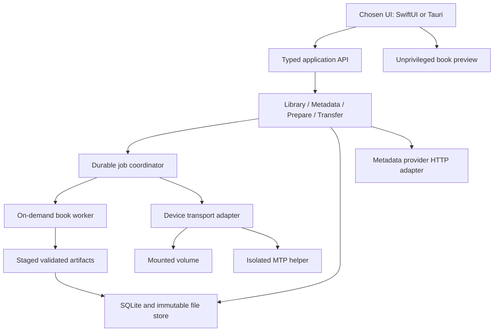
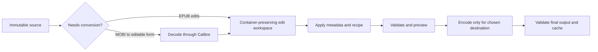
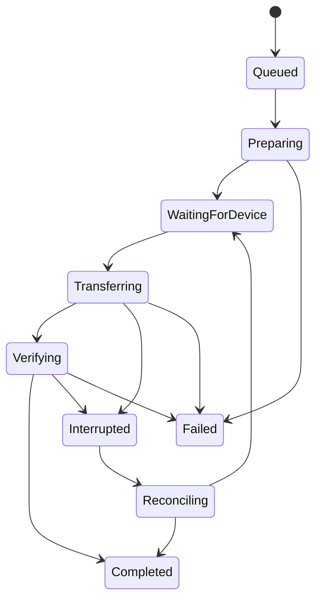

# Calibre Nova: stack and architecture proposal

Date: 2026-09-08. Status: proposed design for review; no application implementation performed.

Inputs: local Calibre 9.14.0 source at commit `025d9cf3a1ef5ce6c9576a29a0963d2175b02d4c`, the product brief, and current primary documentation. The owner accepts GPL reuse and wants the macOS-only and cross-platform choices compared before choosing a platform strategy.

## 1. Recommendation

Build a focused, offline-first desktop library manager around this workflow:

**Import → identify → optionally improve → prepare for this reader → transfer → verify.**

For the original brief—macOS required, other platforms optional—my recommended architecture is **SwiftUI + selective AppKit, a Rust application core, SQLite, and a separate Calibre-derived Python processing worker**. This buys native Mac interaction while preserving most non-UI work for other platforms. Use UniFFI for the Swift/Rust boundary. Do not build a second interface until another platform is funded.

If “optional” really means unlikely, simplify further: **SwiftUI/AppKit + a Swift core + SQLite + the same Python worker**. Rust is justified by credible portability or systems expertise, not by an assumption that Swift is slow.

If Windows and Linux are intended product commitments, choose **Tauri 2 + React/TypeScript + Rust + SQLite + the same worker**, initially releasing on Mac if useful. One shared interface avoids paying for native Swift UI now and a web UI later. React is a pragmatic ecosystem choice; Svelte is a reasonable substitution for a team experienced in it. Framework preference should not drive the architecture.

Across all choices, reuse Calibre's difficult format handling under GPL. Do not make a new MOBI/KF8 writer a prerequisite for shipping Nova. Keep originals immutable, create derived output on demand, and make transfer recovery a first-class feature.

The largest uncertainty is the size and maintenance cost of extracting the converter. This proposal does **not** claim that changing the UI alone makes the complete product small or fast. Prove converter packaging and physical Kindle transfer before extensive UI work.

## 2. Stack choices and what changes

| Concern | Mac only: lowest complexity | Mac first, portable core: recommended for original brief | Shared cross-platform product |
|---|---|---|---|
| Interface | SwiftUI, AppKit where necessary | SwiftUI, AppKit where necessary | Tauri 2, React, TypeScript, Vite; static local assets |
| Application/domain core | Swift packages, structured concurrency, actors | Rust crates | Same Rust crates |
| UI/core boundary | Swift protocols and value types | UniFFI-generated Swift bindings | Small typed Tauri commands/events |
| Library database | SQLite through a narrow Swift repository | SQLite through Rust `rusqlite` | Same |
| Conversion and substantial EPUB edits | Calibre-derived Python worker | Same | Same |
| Preview | Isolated WKWebView | Same | Separate unprivileged book webview |
| macOS devices | Disk Arbitration/IOKit, libmtp helper | Platform adapter plus libmtp helper | Same capabilities behind Tauri shell |
| Future Windows/Linux | Rebuild UI and substantial core integration | Build another UI; reuse core, formats, job protocol, schema | Reuse UI/core; still build and test OS adapters |
| Main cost | Future portability is expensive | Swift + Rust + Python toolchains, FFI and two potential UIs | Webview differences and deliberate native interaction/accessibility work |
| Best reason to choose | A committed Mac product | Mac quality matters most, portability has real option value | A small team maintaining three desktop products |

Apple supports embedding AppKit views inside SwiftUI; use that escape hatch for a large book table if measurement exposes SwiftUI limitations. UniFFI supports Swift bindings. Keep cancellation explicit at the job API rather than assuming cancellation automatically crosses FFI. [Apple integration](https://developer.apple.com/documentation/swiftui/nsviewrepresentable), [UniFFI](https://mozilla.github.io/uniffi-rs/latest/), [async limitations](https://mozilla.github.io/uniffi-rs/next/futures.html).

Tauri uses operating-system webviews, avoiding a bundled browser engine for the UI. On Mac it uses WKWebView, on Windows WebView2, and on Linux WebKitGTK. This reduces one source of distribution weight but does not remove webview memory, Windows runtime installation considerations, or Linux dependency testing. [Tauri architecture](https://v2.tauri.app/concept/architecture/), [webview platforms](https://v2.tauri.app/reference/webview-versions/).

### Alternatives considered

- **Electron:** credible productivity and consistent Chromium rendering, but bundling Chromium/Node conflicts with the small-app objective. No requirement here depends on it.
- **Qt Quick/QML + Python or C++:** credible cross-platform alternative with a modern UI and easier Calibre integration. It could be the quickest route for a Qt-skilled team. It retains more of the runtime footprint we want to reduce; switching from widgets to QML does not solve dependency breadth. Retain as a fallback if converter extraction leaves Qt substantial anyway.
- **Flutter:** credible shared desktop UI, but adds another rendering/runtime stack while book preview and USB/MTP still need integrations. No identified advantage outweighs native Apple UI or Tauri for this brief.
- **Rewrite everything in Rust:** attractive eventual footprint, excessive initial compatibility risk. Revisit individual hot paths after profiling and corpus validation.

Do not build SwiftUI and Tauri shells simultaneously. Platform strategy is the remaining product decision; the processing and storage design below survives either choice.

## 3. Product boundary

### First complete release

- Import local DRM-free EPUB 2/3 and MOBI, including distinguishing legacy MOBI, KF8 and joint containers; extract available metadata and covers.
- Search/sort a local library; edit title, authors, language, identifiers, series and cover. Keep multiple files for a book without merging editions automatically.
- Fetch metadata suggestions and explicitly apply selected results.
- Offer conservative typography presets, such as allowing the reader's own font, adjusting body line spacing/margins, or embedding a selected redistributable font. Provide before/after preview and undo through revision history.
- Produce EPUB for EPUB readers and AZW3 for verified KF8-capable Kindles. Use legacy MOBI output only for explicitly supported old models.
- Transfer to a tested mounted-volume reader and a tested MTP Kindle; show reliable per-book results and recover from disconnects.
- Work without an account or network once installed. Bundle the required format worker in the standard release.

Initial hardware target: one current MTP Kindle family, one older mounted-volume KF8 Kindle, and one Kobo accepting EPUB. Exact model, firmware and OS combinations must be recorded during the first hardware spike. “Kindle support” is not a claim about every Kindle ever made.

Defer full ebook authoring, arbitrary Python plugins, news recipes, stores, AI features, content server, cloud sync, annotations sync, collection-database surgery, PDF/OCR conversion, KFX generation, comic optimization and exhaustive device coverage. Fixed-layout/scripted/media-overlay EPUBs may be imported and exported unchanged when compatible, but typography edits are disabled unless specifically validated. Protected files get a clear unsupported status; an `encryption.xml` containing standard font obfuscation alone is not proof of DRM.

### Formats depend on the delivery route

| Route | Planned artifact | Important constraint |
|---|---|---|
| Kobo or another verified EPUB reader over USB | EPUB | KEPUB is an optional later target, not required for EPUB transfer |
| Verified KF8 Kindle over mounted USB or MTP | AZW3 | EPUB is not a direct Kindle USB target |
| Explicitly supported legacy Kindle | MOBI | Model-specific fallback; do not force this on modern readers |
| Amazon Send to Kindle handoff | EPUB | Amazon processes it; acceptance differs from USB support |

Amazon documents EPUB as a Send to Kindle input and a separate USB transfer route. The local Calibre Amazon device profiles prefer AZW3 and omit EPUB; these are separate format decisions. [Amazon transfer documentation](https://digprjsurvey.amazon.com/csad/help/node/TCUBEdEkbIhK07ysFu), [local profile evidence](/Users/mtajchert/coding/priv/calibre-nova/docs/architecture/calibre-source-audit.md).

Send to Kindle can be a later export-and-open-browser convenience. Do not assume an available public upload API, automate private endpoints, or report a book delivered because Nova exported a file. USB success likewise proves transfer, not completion of the reader's indexing.

## 4. What to reuse from Calibre

Reuse a pinned, narrow processing subset: EPUB/MOBI readers, AZW3/MOBI writers, selected container/polish operations, metadata parsing, relevant native utilities and regression tests. Preserve upstream file locations and notices where possible. Maintain a small patch series rather than silently copying scattered functions into Nova.

Use the device drivers as a specification and source of GPL-compatible model quirks. Implement the initial small transport surface separately; do not drag the full GUI configuration/plugin framework into the core. Reuse driver routines where their dependencies and behavior are understood.

Build a new Nova database and application UI. Calibre's library cache implements broad search/sort behavior in Python; Nova's narrower schema can use indexed SQLite queries and paged results. Do not edit a live Calibre library. An eventual migration reads a consistent snapshot and imports through Nova's normal API.

Calibre already separates conversion from targeted polishing and already offloads work to subprocesses. These are useful designs to preserve. Its broader scope and runtime dependencies are the opportunity to reduce size, not evidence that all existing code needs replacement. Detailed evidence appears in the [source audit](/Users/mtajchert/coding/priv/calibre-nova/docs/architecture/calibre-source-audit.md).

### Worker extraction policy

1. Establish reference conversions with the pinned upstream build on a representative fixture corpus.
2. Trace runtime imports and native library loads for only EPUB/MOBI/AZW3 operations, including fonts, images and failure paths. Static import scans alone are insufficient.
3. Create a dedicated entry point with explicit operation registration. Disable discovery of user plugins and isolate its configuration from an installed Calibre.
4. Package a matching CPython runtime and required native modules. The supplied source declares Python >=3.14; do not silently choose an older interpreter.
5. Exclude viewer/editor UI, WebEngine, recipes, stores and unrelated format plugins only after startup and corpus tests prove those paths independent. Qt Core/Gui may initially remain: `utils/img.py` imports Qt image types and native `imageops`.
6. Replace a small number of image/font boundary dependencies only if measured savings justify the maintenance cost and regression tests protect rendering.

Ship one signed full installer by default. An optional converter download may later reduce the initial download, but it must not disguise the total footprint or make the advertised offline workflow depend on another Calibre installation. A full upstream converter may be used in a development prototype; it is not a successful small-app release if the size gate fails.

`libmobi` is worth evaluating for eventual lightweight inspection, but its documented reading, reconstruction and loaded-document writing are not evidence of a complete EPUB-to-AZW3 compiler. Do not use it as a paper solution to that requirement. [libmobi capabilities](https://github.com/bfabiszewski/libmobi).

GPL reuse is accepted. Proposed Nova distribution license: GPL-3.0-only, compatible with the supplied project's declaration, subject to a per-component license inventory. Ship corresponding source, build instructions, patches and required notices with releases. A subprocess boundary is chosen for fault isolation, not as a presumed copyleft exception. [GNU guidance on combined programs](https://www.gnu.org/licenses/gpl-faq.en.html#MereAggregation).

## 5. Code and process architecture

Use a modular desktop application, not services, a local HTTP backend, or a permanent daemon. Start with these build units; keep feature modules inside them until separate packaging or test boundaries justify more crates.

```text
apps/macos/                       SwiftUI/AppKit UI and OS integration
apps/desktop/                     Tauri/React alternative; build only if selected
crates/nova-core/
  library/                        import, book identity, search, metadata revisions
  prepare/                        recipes, target selection, artifact cache
  jobs/                           durable queue, recovery, cancellation
  transfer/                       transfer planning, receipts, reconciliation
  metadata/                       provider queries, ranking, provenance
  ports/                          repository, worker, device and HTTP interfaces
crates/nova-storage/               SQLite migrations, queries, blob repository
crates/nova-platform/              worker launcher, devices, HTTP adapters
crates/nova-bindings/              UniFFI facade for native Mac option
workers/book-worker/               Python protocol wrapper and processing operations
workers/device-helper/            isolated MTP backend
vendor/calibre/                   pinned subset + upstream commit + patch manifest
tests/fixtures/                    legally redistributable books and expected invariants
tests/contract/                    UI/core, worker and transport conformance
docs/architecture/                 decisions, compatibility matrix, measurements
```

This is the proposed future layout; the supplied `calibre/` checkout stays untouched. In the strictly Mac-only option, replace Rust build units with Swift packages retaining the same feature/port boundaries. Do not maintain Swift and Rust implementations of domain rules together.



### Ownership rules

- The core owns business rules, database writes, job state, output profiles and transfer receipts. The UI owns presentation, selection, accessibility and transient form drafts.
- Workers receive staged inputs and output destinations. They never open the library database, mutate originals, download metadata or discover arbitrary paths.
- Core-facing results use IDs and small records, not XML DOMs or Calibre objects. Book bytes remain in files; never send base64 books through FFI or webview IPC.
- A database writer queue serializes short transactions. CPU-heavy work and blocking USB calls run outside UI and database threads. Rust async orchestration does not make blocking work nonblocking; use bounded blocking pools/helpers.
- Start one book worker on demand. Allow up to two only after memory measurements; serialize each MTP device session. A crash fails one job, not the library UI.

### Stable application contract

Conceptual operations, implemented as typed methods in the selected stack:

| Operation | Result and contract |
|---|---|
| `importBooks(grants, requestId)` | Batch job ID; file access granted by host, idempotent request |
| `queryLibrary(filter, sort, cursor, limit)` | Page of summaries with stable ID tie-breaker |
| `updateMetadata(bookId, expectedRevision, patch)` | New revision or explicit conflict |
| `findMetadata(bookId)` | Job ID; suggestions do not mutate accepted metadata |
| `prepareEdition(assetId, metadataRevision, recipeId, targetProfile)` | Job ID resolving to immutable artifact |
| `planTransfer(artifactIds, deviceSession)` | Space/format/collision plan, with warnings |
| `startTransfer(planId, requestId)` | Durable job; revalidate session and preconditions |
| `cancelJob(jobId)` | Explicit cancellation request, independently of UI task lifetime |
| `getJob(jobId)` / `subscribeEvents(afterSequence)` | Durable snapshot plus transient progress |

Events include sequence number, job ID, stage, completed/total units where known, and structured error code. Throttle progress delivery to roughly 10 updates/second. On reconnect or sequence gaps, fetch snapshots. Never infer job completion from an event alone.

Worker protocol: versioned, size-limited newline-delimited JSON over stdio, startup capability handshake, one operation per worker at a time. Requests identify job, allowed operation, staged input/output paths and validated options. Stdout is protocol-only; logs go to stderr. Errors include `INVALID_BOOK`, `PROTECTED_CONTENT`, `UNSUPPORTED_FEATURE`, `LIMIT_EXCEEDED`, `WORKER_CRASHED`, and `CANCELLED`. Kill the worker process group after a cancellation grace period. An interrupted output is never promoted.

Process separation provides crash containment; it does not itself provide a security sandbox. Stage minimal files, strip unnecessary environment/config access, disable processing-time network access through supported OS restrictions where available, and validate output independently before promotion. Validate the hardened/signed helper behavior in the packaging spike rather than relying on an unspecified universal sandbox.

## 6. Library and storage model

Use SQLite with foreign keys, migrations, WAL on local storage, indexed queries and metadata FTS5. Search metadata initially; full-text extraction of every book would add unnecessary import work. SQLite WAL has local shared-memory constraints, so exclude active libraries on network filesystems and do not advertise live cloud-folder database synchronization. [SQLite WAL](https://sqlite.org/wal.html).

| Entity | Important fields and meaning |
|---|---|
| Book | Stable UUID; a user-facing edition, not automatically an abstract literary work |
| Asset | SHA-256, byte length, detected format/subtype, original filename, immutable blob reference |
| BookAsset | Book-to-asset association; exact bytes can be referenced without duplicate storage |
| MetadataRevision | Book ID, monotonic revision, accepted field values and provenance |
| MetadataCandidate | Provider/edition ID, proposed fields, retrieval time, ranking evidence |
| Recipe | Versioned ordered transformations and parameters; referenced font/cover hashes |
| Artifact | Source hash, metadata revision hash, recipe hash, worker version, target profile version, output hash, validation report |
| DeviceProfile | Versioned capability policy, destination paths, format preferences, verification limits |
| DeviceObservation | Transport identity, observed model/firmware when available, confidence and session generation |
| TransferReceipt | Artifact hash, device identity, path/object ID, verification strength, last reconciliation |
| Job / JobStep | Durable request, state, attempts, dependencies, error and owned temporary objects |

One file hash detects duplicate bytes. Matching title/author/ISBN suggests a possible duplicate edition and asks for resolution; it does not silently collapse books. Reimport uses the existing asset and reports what happened.

```text
Library/
  library.sqlite
  originals/sha256/ab/<hash>        immutable source bytes
  metadata/<book-id>/<revision>.json
  artifacts/sha256/ab/<hash>        reproducible, evictable outputs
  thumbnails/                     evictable
  jobs/<job-id>/                   owned staging and bounded logs
```

An artifact cache key includes source hash, metadata content, recipe/version, all resource hashes, target profile/version and engine/build version. Output content hash is recorded separately: a cache key is not proof that a tool emits byte-identical ZIP files across runs. Normalize timestamps/order where possible and test semantic determinism otherwise.

Import stages and hashes a private copy, atomically promotes it on the same filesystem, then commits references. A crash between promotion and commit may leave an orphan, which a reconciler can safely collect after a grace period; it must never leave a committed reference to missing bytes. No hard link may allow editing an original through a working copy. Disk-full failures preserve source files and leave recoverable job state.

Cache eviction excludes artifacts leased by active jobs. Metadata revisions and originals are durable. SQLite is authoritative for accepted metadata; revision JSON files are recoverable exports generated after commits and reconciled on restart, not a second independent writer. Backup uses SQLite's backup mechanism plus referenced immutable files and a manifest; copying only `library.sqlite` while WAL is active is insufficient. Restore verifies hashes and schema compatibility before replacing the active library.

## 7. Key pipelines

### Import


Inspect ZIP/container structure rather than trusting extensions. Fast EPUB metadata inspection may use a small Rust ZIP/XML adapter; reuse the worker for MOBI and exceptional EPUB cases. Avoid loading all resources just to display a title. Hash and copy as a stream. Limit decompressed sizes, entry count, XML depth, image pixels and operation time; reject path traversal, symlinks, duplicate ambiguous archive paths and external XML entities. A failed file does not roll back other imports in a batch.

### Metadata enrichment

Read embedded OPF/EXTH first, then filename as a visibly lower-confidence fallback. For online lookup, query a valid ISBN/identifier when present; otherwise use title + author + language. Return several edition candidates with reasons, not an unexplained numerical certainty. Never silently replace a user-edited value. Apply suggestions as a metadata revision; preserve original embedded metadata for comparison.

Use Open Library first for interactive low-volume lookup, with caching, identification, backoff and conservative rate limiting. Do not run thousands of individual queries automatically on bulk import; its API policy explicitly discourages that use. Google Books is a secondary adapter with explicit API-key/quota handling; do not treat an embedded desktop key as secret. Basic local use must survive provider outages. [Open Library API policy](https://openlibrary.org/developers/api), [Google Books API](https://developers.google.com/books/docs/v1/using).

Only transmit query metadata and requested cover URLs, not book contents. Bound fetched data and redirects, reject local/private network destinations, decode covers defensively, and retain provider attribution and retrieval time. Online enrichment starts only under the user's chosen lookup behavior.

### Improvements and preparation



The interchange form is an EPUB-like publication package: manifest, spine, navigation, XHTML, CSS, images and fonts. It is a temporary editing representation, not a requirement to convert every import. Unchanged compatible files can be sent as-is. Same-format EPUB edits retain untouched resources and structure; do not send them through the full conversion/flattening pipeline by default.

Recipes are ordered typed operations, not arbitrary scripts: update metadata/cover, allow reader font, set body spacing, adjust body margins, embed selected font. Parse CSS and inspect inline styles; regex replacement or a universal `* { font-family: ... !important }` breaks code, symbols and special typography. Preserve headings, emphasis, RTL/CJK behavior, footnotes and monospace content. Font embedding requires an appropriate license and manifest/CSS updates; font subsetting is deferred until a dedicated quality gate is passed.

Preview settings and exported book modifications are distinct. A preview font slider does not change the file unless saved into a recipe. Show before/after, explain unsupported layout changes, and allow reverting to any revision. Preview demonstrates intended typography; actual Kindle rendering is tested on hardware, not emulated by a browser screenshot.

Runtime validation checks container integrity, manifest/spine references, navigation, CSS/resource references and output readability. Existing nonfatal EPUB issues are reported separately from newly introduced errors. Use EPUBCheck in CI/release validation, without requiring a Java runtime in the shipped UI. EPUBCheck validates EPUB conformance, not visual quality or AZW3 compatibility. [EPUB specification](https://www.w3.org/TR/epub-33/), [EPUBCheck](https://github.com/w3c/epubcheck).

### Device transfer and recovery



Other terminal paths include explicit cancellation; a partially written remote object remains in the journal until cleanup is confirmed. Completion requires both a transfer result and a receipt persisted by the core.

Device detection returns a transport plus a versioned capability profile: accepted output formats, destination directories, path limits, free space, rename/readback support and optional cover support. Keep this separate from book conversion. Use OS mount notifications for storage devices. On macOS/Linux use libmtp/libusb for MTP in a helper; on Windows use the native Windows Portable Devices API. Calibre already makes the Unix/Windows distinction. [libmtp](https://github.com/libmtp/libmtp).

Plan before writing: select an accepted artifact, check space, sanitize names, resolve collisions, validate device identity/session generation, and show replacements. A reconnect invalidates handles and object IDs. Serialize writes per device and support an explicit “device busy in another application” state.

For a mounted volume, write an owned temporary file next to the destination, flush, verify by readback hash, then rename where supported. Journal each step and persist the receipt. Filesystems differ in rename/durability behavior; verify on the actual supported device instead of promising filesystem-independent atomicity.

For MTP, operate on object IDs. Do not pretend it is a POSIX filesystem: random writes, resume, rename and atomic replace are not guaranteed. Track upload intent, unique target name, parent, artifact hash and returned object ID. If possible upload under a temporary name and rename after verification; otherwise upload a uniquely named new object. Keep an existing book until the replacement is verified and replacement was requested.

After a timeout/disconnect, reconcile the journal with remote objects before retrying. Read back/hash when supported; otherwise record successful protocol completion plus observed size as weaker verification. If ownership or completion is ambiguous, require review rather than deleting or duplicating blindly. A job ID is not a device-side exactly-once guarantee.

Default behavior never deletes unrelated device files. Cover/APNX upload is a separate optional step: its failure yields “book transferred; cover unavailable”, not an automatic retransmission of the book. Offer safe eject/release once all jobs settle; label the result “transferred”, since reader indexing is outside Nova's control.

## 8. Responsiveness, security and operability

Load only the initial library page, virtualize rows/covers, and decode thumbnails lazily. Do not load every cover, extract every chapter, scan an entire device or start Python at launch. Prefer events to polling. Hash/convert only what the user needs and reuse validated artifacts. These choices matter more than replacing Python wholesale.

Book preview is untrusted content. Use a separate view with no privileged bridge, no arbitrary filesystem/network access, no book JavaScript, blocked external navigation and a scoped resource handler. Block active nested content and external CSS/image loads. A Tauri preview must have no app-command capabilities; the trusted application webview alone gets narrowly scoped commands. [Tauri capabilities](https://v2.tauri.app/security/capabilities/).

Log job IDs, operation stages, durations, engine versions and actionable errors. Avoid book text, full personal paths and credentials in default logs. Support a user-exported diagnostic bundle. No analytics backend is necessary for v1.

### Proposed budgets, not measured claims

Benchmark a release build on an Apple Silicon Mac with 16 GB RAM and SSD, with 10,000 metadata records and a defined mixed-format fixture set. Record exact hardware/OS and count all child/webview/helper processes. Run at least 30 iterations for latency distributions. Record cold and warm runs separately.

| Metric | Initial target |
|---|---|
| Launch to interactive initial library page | p95 <=1.5 s, no worker/preview startup |
| Indexed metadata query, 10k books | p95 <=100 ms in core; visible results <=200 ms |
| Library scrolling | 60 fps target on reference Mac, including thumbnail loading |
| Idle application footprint, no preview | <=150 MiB across owned processes |
| Typical single conversion | <=512 MiB worker budget; larger books run with explicit bounded policy |
| UI/core compressed distribution | <=40 MiB per architecture |
| Complete installed distribution including converter | <=200 MiB target, and <=50% of measured equivalent Calibre installation |
| Idle activity | No ongoing conversion/network activity; near-zero sustained CPU |

Conversion latency depends on book complexity; benchmark EPUB→AZW3, MOBI→EPUB and typography-only edits independently against the pinned Calibre baseline. Target <=10% overhead for reused conversion paths. The UI must remain responsive regardless. Do not label targets as accomplished until a packaged build is measured. If extraction misses the complete-size target, revise dependencies/scope or explicitly revise the product target before committing to marketing claims.

## 9. Delivery sequence and release gates

This is a delivery roadmap for the architecture, not a claim that an executable implementation plan or prototype already exists. Each stage produces an independently reviewable working increment.

| Stage | Deliverable | Exit evidence |
|---|---|---|
| 0. Compatibility and size proof | CLI-level converter package and basic volume/MTP transfer | Packaged EPUB→AZW3 and MOBI→EPUB on clean Mac; import and open on selected Kindle/Kobo; loaded-library inventory and size report; disconnect recovery experiment |
| 1. Library foundation | Chosen UI, immutable import, SQLite, local metadata, covers, search | 10k-record responsiveness; duplicate import and disk-full recovery; corrupt archive rejection; restart consistency |
| 2. First complete send | Job queue, device profile selection, prepare/cache/transfer/receipts | Import EPUB and MOBI, send to supported readers, retry without silent duplicates, reopen after interruption |
| 3. Improve and identify | Reviewed metadata suggestions, conservative recipes, isolated preview | Before/after tests for Latin, Polish, RTL and CJK fixtures; source hashes unchanged; edits survive actual reader transfer |
| 4. Release hardening | Signed/notarized installer, updates, backups, diagnostics, GPL source bundle | Fresh-machine install without Python/Calibre; migration/restore rehearsal; full size/RAM report; hardware compatibility table |
| 5. Optional platform expansion | Tauri UI if needed and OS adapters | Windows/Linux core tests plus actual install, MTP/mounted transfer and accessibility testing on each supported OS |

Stage 0 is deliberately before a polished library interface. It addresses the riskiest claims: small bundled conversion and real device behavior. Budget it as a short engineering investigation, then estimate delivery from its measurements and the team's Swift/Rust/Python experience. Do not assign a confident whole-product date from a static source review.

### Test and release pipelines

Pull requests: formatting/static analysis → core unit/property tests → fixture corpus → worker contract tests → transport simulator/fault tests → selected UI accessibility/smoke tests → dependency/license checks. Use Rust tests/Clippy, pytest for the worker, XCTest for native Mac, or TypeScript/Vitest and browser component tests for Tauri. Browser-only tests do not prove Tauri IPC, native integration or actual reader rendering.

Nightly/format changes: EPUBCheck, semantic checks on generated output, differential comparison with upstream, malformed-input fuzzing, large-library performance, and forced crashes at file/DB/transfer commit boundaries. Semantic checks include text retention, chapter/spine order, navigation, covers, images, language and font references; comparing only ZIP bytes is inadequate. Use public-domain or explicitly licensed fixtures, with a manifest of provenance.

Hardware gates: record model, firmware, OS, transport and output format. Cover unplug during upload/verification, full device, device lock/sleep, competing MTP application, Unicode filenames, replacement and resending, covers and reader indexing. A simulator cannot certify those behaviors.

Release: pinned toolchains and dependency locks → build app/workers for each supported architecture → package → sign nested helpers/libraries and app → notarize/staple macOS distribution → fresh-machine smoke tests → checksums, SBOM/notices and corresponding source → signed update metadata. Choose direct download initially; validate Mac App Store constraints separately. Never modify a signed bundle to install a converter after signing.

Updates use a versioned app/worker capability handshake. Database migrations run after a consistent backup, atomically where possible; an older binary must refuse a newer incompatible schema. Rollback restores a compatible application and database snapshot, not just an older executable. Keep worker dependency updates behind the corpus and hardware gates.

## 10. Decisions to carry forward

Accepted from the owner: local EPUB/MOBI workflows, Mac required, platform alternatives must be compared, GPL reuse is acceptable.

Recommended architectural decisions: new UI/library, optional portable core, pinned Calibre processing worker bundled by default, capability-driven transports, immutable originals, derived artifacts, durable jobs, no mandatory backend.

Still a product choice: committed Mac-only simplicity versus native Mac with portable core versus one shared cross-platform UI. The default recommendation is the middle option under the original brief. Once that choice is made and Stage 0 resolves dependency/device risks, write implementation plans per stage; avoid building three architectures to postpone the decision.
